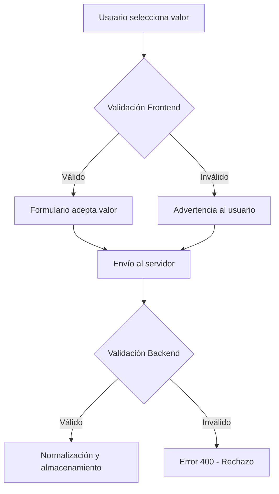
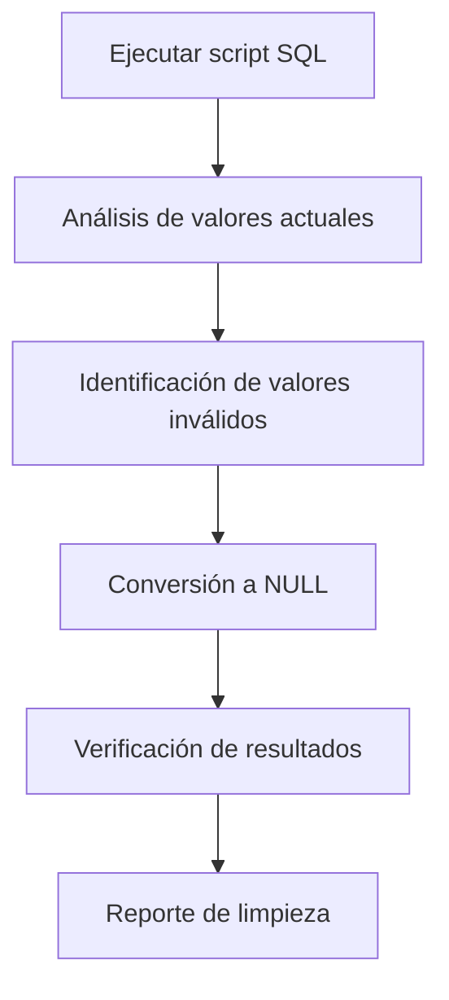

# Validación del Campo "requiere_pago"

## Resumen

Este documento describe las validaciones implementadas para asegurar la consistencia de datos en el campo `requiere_pago` de la tabla `tramites`.

## Problema Identificado

El campo `requiere_pago` en la base de datos contenía valores inconsistentes que no eran ni "Sí" ni "No", lo que causaba problemas de presentación y consistencia de datos.

## Solución Implementada

### 1. Validación Frontend (Cliente)

**Archivo:** [`lib/utils/validation.ts`](lib/utils/validation.ts)

#### Funciones Implementadas:

- **`isValidRequierePago(value)`**: Valida que el valor sea "Sí", "No", null, undefined o vacío
- **`normalizeRequierePago(value)`**: Normaliza valores, convirtiendo valores inválidos en null
- **`validateAndNormalizeRequierePago(value)`**: Validación y normalización combinadas para backend

#### Uso en Formulario:

**Archivo:** [`app/admin/tramites/[id]/editar/page.tsx`](app/admin/tramites/[id]/editar/page.tsx)

- El formulario muestra una advertencia cuando el valor en la base de datos no es válido
- Los radio buttons solo permiten seleccionar "Sí" o "No"
- Los valores inválidos se muestran pero se marcan como no válidos

### 2. Validación Backend (Servidor)

**Archivo:** [`app/api/admin/tramites/create/route.ts`](app/api/admin/tramites/create/route.ts)

- Validación obligatoria antes de insertar/actualizar registros
- Rechaza solicitudes con valores inválidos retornando error 400
- Normaliza valores antes de almacenarlos en la base de datos

### 3. Limpieza de Datos Existentes

**Archivo:** [`scripts/16-clean-requiere-pago-values.sql`](scripts/16-clean-requiere-pago-values.sql)

Script SQL que:
- Verifica valores actuales antes de la limpieza
- Identifica registros con valores inconsistentes
- Convierte valores inválidos a NULL
- Muestra resumen de los cambios realizados

## Valores Válidos

El campo `requiere_pago` ahora solo acepta:

- `"Sí"` - El trámite requiere pago
- `"No"` - El trámite no requiere pago  
- `NULL` - Valor no especificado (recomendado para datos faltantes)
- `""` - Cadena vacía (también se convierte a NULL)

## Flujos de Validación

### 1. Creación/Edición de Trámites

### 2. Limpieza de Datos

## Consideraciones de Seguridad

1. **Validación Doble**: Tanto frontend como backend validan para prevenir bypass
2. **Normalización Segura**: Valores inválidos se convierten a NULL en lugar de ser rechazados completamente
3. **Auditoría**: El script de limpieza incluye reportes detallados de los cambios
4. **Conservador**: La limpieza convierte valores inválidos a NULL en lugar de eliminar registros

## Pruebas Recomendadas

1. **Pruebas de Formulario**: Verificar que solo se acepten "Sí" y "No"
2. **Pruebas de API**: Validar respuestas de error 400 para valores inválidos
3. **Pruebas de Base de Datos**: Confirmar que no se almacenen valores inconsistentes
4. **Pruebas de Limpieza**: Ejecutar script en ambiente de pruebas antes de producción

## Mantenimiento

- **Monitoreo**: Revisar periódicamente la consistencia de datos
- **Alertas**: Considerar alertas si aparecen nuevos valores inválidos
- **Documentación**: Mantener actualizada esta documentación con cambios futuros

## Archivos Relacionados

- [`lib/utils/validation.ts`](lib/utils/validation.ts) - Funciones de validación
- [`app/admin/tramites/[id]/editar/page.tsx`](app/admin/tramites/[id]/editar/page.tsx) - Formulario de edición
- [`app/api/admin/tramites/create/route.ts`](app/api/admin/tramites/create/route.ts) - API de creación/edición
- [`scripts/16-clean-requiere-pago-values.sql`](scripts/16-clean-requiere-pago-values.sql) - Script de limpieza de datos

## Historial de Cambios

| Fecha | Versión | Descripción | Autor |
|-------|---------|-------------|-------|
| 2025-10-25 | 1.0 | Implementación inicial de validación | AI Assistant |